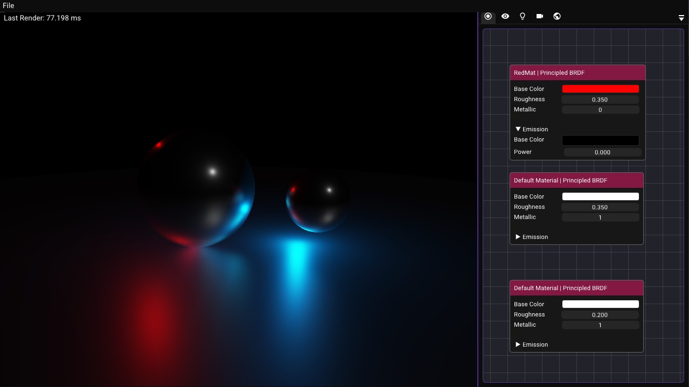

# Ottocento Renderer

Ottocento Renderer is a study project developed by Lucas M. with the intent of learning the building blocks of Raytracing and Graphics Programming in C++. The core idea is to build a basic rendering application with a codebase that can be used as a model for new experiments, mainly focused on learning the algorithms, architecture/design patterns, performance optimizations and math related to the different sides of computer graphics. It is important to notice that, since this is a study project, most of the features of a regular rendering application will be missing, as well as sophisticated optimization algorithms. Still, I hope to learn each concept to the best of my ability as I go.

This project is highly resourced from [The Cherno's](https://www.youtube.com/@TheCherno) [Ray Tracing series](https://www.youtube.com/watch?v=gfW1Fhd9u9Q&list=PLlrATfBNZ98edc5GshdBtREv5asFW3yXl), available in his YouTube Channel, as well as using the [RayTracing in One Weekend](https://raytracing.github.io/) book, also recommended by Cherno. Both are really great to understand many of the core concepts of RayTracing. I will also leave other links in the `Resources` topic.

This application uses an app template from [Walnut](https://github.com/TheCherno/Walnut), developed by Studio Cherno — unlike the example within the Walnut repository, this keeps Walnut as an external submodule and is much more sensible for actually building applications. See the [Walnut](https://github.com/TheCherno/Walnut) repository for more details.

## How to build from source
Once you've cloned, run `scripts/Setup.bat` to generate Visual Studio 2022 solution/project files. Your app is located in the `WalnutApp/` directory, which some basic example code to get you going in `WalnutApp/src/WalnutApp.cpp`.

### Documentation
 - To see how we style our code, please refer to the [Code Style Guide](/doc/styleguide.md).
 - A proper development report with my progress is in the works.

### Features
- [x] Simple functioning camera.
- [x] Moveable Camera with WASD + Mouse controls.
- [x] Ray casting and Sphere Intersection.
- [x] Pathtracing accumulation.
- [x] Multiple lights in a scene with the possibility to spawn more lights and control its parameters.
- [x] Multiple objects in a scene with the possibility to spawn more objects and control its parameters.
- [x] Physically Based BRDF Materials wiht Schlick GGX calculation.
- [x] Metallic Materials using the same BRDF Materials as above.
- [x] Camera Depth of Field Blur (Still in the need of being enhanced).
- [x] Basic Multithreading serialization optimization.
- [ ] Bounding Volume Hierarchies (BVH) optimization.
- [ ] Texture Mapping.
- [ ] Rendering Quadrilaterals.
- [ ] Cornell Box simple scene for testing.
- [ ] More robust light controls with emissive materials.
- [ ] Rendering Triangles.
- [ ] Global Illumination.
- [ ] Volumes, Smoke and Fog Boxes.
- [ ] Scene loading from other software.

## Resources
 - [The Cherno Ray Tracing series.](https://www.youtube.com/watch?v=gfW1Fhd9u9Q&list=PLlrATfBNZ98edc5GshdBtREv5asFW3yXl)
 - [RayTracing in One Weekend](https://raytracing.github.io/)
 - [Scratch a Pixel 4.0: Learn Computer Graphics Programming](https://www.scratchapixel.com/index.html)
 - [Stanford CS348b Lecture 12 — Reflection Models](https://graphics.stanford.edu/courses/cs348b-18-spring-content/lectures/12_reflection2/12_reflection2_slides.pdf)
 - [Physically Based Rendering // OpenGL Tutorial #43](https://www.youtube.com/watch?v=XK_p2MxGBQs)
 - [Learn OpenGL PBR Ligthing](https://learnopengl.com/PBR/Lighting)
 - [Real Shading in Unreal Engine 4 (Brian Karis)](https://blog.selfshadow.com/publications/s2013-shading-course/#course_content)
 - [ Kohi #034: Loading and Swapping Textures (Vulkan Game Engine Series) ](https://www.youtube.com/watch?v=2IxHj52-Kag)
 - [Coding Adventure: Optimizing a Ray Tracer (by building a BVH)](https://www.youtube.com/watch?v=C1H4zIiCOaI)
